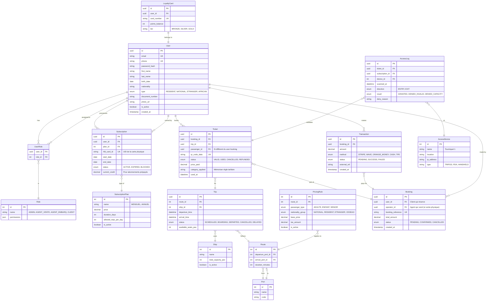

# Schéma de Base de Données - Billetterie Maritime

Ce document détaille la structure de la base de données PostgreSQL pour le système de billetterie.

## 📐 Diagramme Entité-Relation (ERD)

## 📝 Dictionnaire des Données

### 1. Gestion des Utilisateurs (`users`, `roles`)
La table `users` est centrale. Elle gère à la fois les **clients finaux**, les **agents de guichet** et les **administrateurs**.
- **Discrimination** : Le type d'utilisateur est défini par son rôle (RBAC).
- **Profil Client** : Les champs `nationality`, `type` (Résident, National...) sont cruciaux pour déterminer le tarif applicable automatiquement.

### 2. Gestion des Abonnements (`subscriptions`, `subscription_plans`)
Pour gérer l'exigence des abonnements "mensuel, trimestriel, annuel" et le support RFID.
- `rfid_card_id` : Stocke l'UID unique de la carte physique. Permet un scan rapide au tourniquet.
- **Logique** : Lors d'un scan RFID, le système vérifie si `end_date` > `now()` et si `status` == `ACTIVE`.

### 3. Tarification Dynamique (`pricing_rules`)
C'est le moteur de flexibilité. Au lieu de prix fixes par trajet, on utilise des règles.
- Une règle relie une `route` (ex: Dakar-Gorée) à :
    - Un type de passager (Enfant, Adulte)
    - Un groupe de nationalité (National, Résident, Étranger)
- **Exemple** :
    - Règle 1 : Route A + Adulte + National = 5000 FCFA
    - Règle 2 : Route A + Adulte + Étranger = 8000 FCFA
- Cela permet de modifier les prix sans changer le code.

### 4. Billetterie (`bookings`, `tickets`, `trips`)
- `Booking` : C'est le "Dossier" de réservation (Panier). Peut contenir plusieurs tickets.
- `Ticket` : C'est l'unité de droit de passage (1 personne = 1 ticket).
    - Possède son propre `qr_code_data` unique.
    - Possède un statut `USED` une fois passé au tourniquet.
- `Trip` (Traversée) : Instance concrète d'un voyage à une date/heure donnée.
    - Gère le **Quota** avec `available_seats_pax`.
    - Le système doit décrémenter ce compteur à chaque vente confirmée.

### 5. Contrôle d'Accès (`access_logs`, `access_devices`)
Pour le **reporting détaillé** demandé (Suivi des passages tourniquets, contrôles PDA).
- Chaque scan (réussi ou échoué) est loggué dans `AccessLog`.
- Permet de savoir : "Combien de personnes sont passées au Tourniquet 2 entre 10h et 11h ?".
- Essentiel pour la **détection de fraude** (double passage).

### 6. Paiements (`transactions`)
- Supporte multiples méthodes (`method`).
- `operator_id` dans `Booking` permet de savoir quel Caissier a vendu le ticket (pour le rapport de caisse fin de journée).

---
## 🔍 Points d'attention pour l'implémentation

1.  **Concurrence sur les quotas** : Lors de la réservation, utiliser des *transactions DB* avec verrouillage (ou `UPDATE ... WHERE available_seats > 0`) pour éviter la surréservation.
2.  **Performance RFID** : L'index sur `rfid_card_id` doit être optimal car la validation au tourniquet doit prendre < 500ms.
3.  **Mode Offline** : Les PDA et bornes devront synchroniser une version locale (allégée) des tables `tickets` (pour les départs du jour) et `subscriptions`.
