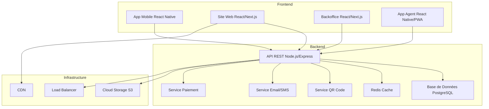

# Projet Billetterie Maritime - Plan Complet & Feuille de Route

## 📋 Vue d'Ensemble du Projet

### Vision
Développer une plateforme complète de billetterie maritime permettant la réservation en ligne, la gestion des abonnements, et l'embarquement digitalisé via QR codes.

### Composantes du Système
1. **Application Mobile** (iOS & Android)
2. **Site Web de Réservation**
3. **Backoffice Administrateur**
4. **Application Agent d'Embarquement**
5. **Système de Contrôle d'Embarquement Physique** (Tripodes, Lecteurs QR)
6. **Points de Vente Physiques** (Caisses équipées)
7. **Affichage Dynamique** (Passagers en attente)

---

## 🏗️ Architecture Technique

---

## 📱 COMPOSANTE 1: Application Mobile

### Fonctionnalités Utilisateur

#### 1.1 Authentification & Profil
- [x] Inscription (email, téléphone, réseaux sociaux)
- [x] Connexion / Déconnexion
- [x] Récupération mot de passe
- [x] Profil utilisateur
  - Informations personnelles
  - Photo de profil
  - Historique des réservations
  - Documents d'identité sauvegardés
- [x] Gestion des préférences
- [x] Notifications push (rappels embarquement, promotions)

#### 1.2 Recherche & Réservation
- [x] Recherche de traversées
  - Port de départ
  - Port d'arrivée
  - Date de voyage
  - Heure de départ
  - Sens de circulation (aller, retour, aller-retour)
  - Nombre de passagers (adultes, enfants)
  - Type de client (Sénégalais, Africain, Hors Afrique, Résidents)
  - Marchandises/Fret (optionnel)
  - Véhicules (optionnel)
- [x] Filtres avancés
  - Horaires
  - Compagnies maritimes
  - Type de bateau
  - Gamme de prix
  - Services disponibles (restauration, cabine, etc.)
- [x] Affichage des résultats
  - Disponibilité en temps réel
  - Prix détaillés par catégorie
  - Durée de la traversée
  - Services inclus
  - Photos du bateau
- [x] Sélection des sièges/cabines (si applicable)

#### 1.3 Panier & Paiement
- [x] Ajout au panier
  - Plusieurs passagers
  - Plusieurs trajets
  - Services additionnels
- [x] Gestion du panier
  - Modifier quantités
  - Supprimer articles
  - Sauvegarder pour plus tard
- [x] Récapitulatif de commande
- [x] Saisie des informations passagers
  - Nom, prénom
  - Date de naissance
  - Nationalité
  - N° document d'identité
  - Type de passager (Résident, National, Étranger)
- [x] Informations marchandises (si applicable)
  - Type de marchandise
  - Poids/dimensions
  - Documents requis
- [x] Modes de paiement
  - Carte bancaire (Visa, Mastercard)
  - Mobile Money (Orange Money, Wave, Free Money)
  - Paiement à la réception (selon conditions)
- [x] Confirmation instantanée
- [x] Envoi email/SMS avec QR code

#### 1.4 Dashboard Personnel
- [x] Vue d'ensemble
  - Prochains voyages
  - Historique
  - Points de fidélité
- [x] Mes Réservations
  - Réservations actives
  - Réservations passées
  - Réservations annulées
  - Télécharger les billets (PDF + QR code)
- [x] Gestion des abonnements
  - Abonnements actifs
  - Date d'expiration
  - Renouvellement
  - Historique d'utilisation
- [x] Programme de Fidélité
  - Affichage du badge fidélité (code-barres/QR)
  - Niveau de fidélité (Bronze, Argent, Or, Platine)
  - Points accumulés
  - Récompenses disponibles
  - Historique des transactions points
- [x] Mes Passagers Fréquents
  - Enregistrer des profils (famille, amis)
  - Réservation rapide pour ces profils

#### 1.5 Services Additionnels
- [x] Modification de réservation (selon conditions)
- [x] Annulation (selon politique)
- [x] Demande de remboursement
- [x] Support client
  - Chat en direct
  - Email
  - Téléphone
  - **Intégration centre d'appel du Port**
- [x] FAQ dynamique
- [x] Alertes de prix
- [x] Mode hors ligne (consultation des billets)
- [x] Centre de gestion des réclamations

---

## 🌐 COMPOSANTE 2: Site Web de Réservation

### Fonctionnalités Publiques

#### 2.1 Page d'Accueil
- [x] Slider/Bannière dynamique
  - Voyages à venir
  - Événements spéciaux
  - Promotions
- [x] Moteur de recherche principal
  - Filtres par date, heure, sens de circulation, type
  - Recherche avancée (passagers, marchandises, véhicules)
- [x] Promotions et offres spéciales
- [x] Destinations populaires
- [x] Témoignages clients
- [x] Actualités maritimes

#### 2.2 Page Détails du Voyage/Événement
- [x] Galerie d'images/vidéos du bateau
- [x] Tableau des différents types de billets
  - Passagers (adulte, enfant, résident, etc.)
  - Cabines (si applicable)
  - Marchandises
  - Véhicules
- [x] Détails de la traversée
  - Date, heure de départ/arrivée
  - Durée estimée
  - Services à bord
  - Informations pratiques (bagages, documents)
- [x] Calendrier pour choisir la date
- [x] Bouton d'achat/réservation

#### 2.3 Recherche & Réservation
- [x] Toutes les fonctionnalités de l'app mobile
- [x] Interface optimisée desktop/tablet
- [x] Comparateur de prix
- [x] Calendrier de prix sur 30 jours
- [x] Affichage disponibilité en temps réel

#### 2.4 Gestion des Billets (Confirmation et QR Code)
- [x] Envoi automatique email avec billet PDF
  - QR Code unique
  - Détails de la réservation
  - Instructions d'embarquement
- [x] Affichage du billet dans l'espace personnel
- [x] Options de téléchargement/impression
- [x] Partage de billets par email

#### 2.5 Informations & Services
- [x] Horaires des traversées en temps réel
- [x] Informations sur les bateaux (photos, services, capacité)
- [x] Grille tarifaire complète
- [x] Conditions générales de vente
- [x] Politique d'annulation/modification/remboursement
- [x] Informations pratiques
  - Documents requis
  - Bagages autorisés
  - Procédure d'embarquement
  - Services à bord
  - Transport de marchandises

#### 2.6 Espace Client
- [x] Connexion / Inscription
- [x] Dashboard complet (comme app mobile)
- [x] Partage de billets par email
- [x] Impression des billets

#### 2.7 Programme de Fidélité
- [x] Présentation du programme
- [x] Inscription au programme
- [x] Consultation du solde de points
- [x] Catalogue de récompenses

#### 2.8 Support Client
- [x] Chat en direct / Chatbot
- [x] Page FAQ dynamique
- [x] Formulaire de contact
- [x] Support par email
- [x] Intégration centre d'appel Port de Dakar

#### 2.9 SEO & Marketing
- [x] Meta tags optimisés
- [x] Sitemap XML
- [x] Schema.org markup
- [x] Blog (conseils voyage, destinations)
- [x] Newsletter
- [x] Intégration réseaux sociaux

---

## 🎛️ COMPOSANTE 3: Backoffice Administrateur

### 3.1 Dashboard Général
- [x] KPIs en temps réel
  - Réservations du jour (passagers + marchandises)
  - Chiffre d'affaires
  - Taux de remplissage par traversée
  - Taux de réservation en temps réel
  - Nouveaux clients
  - Passages aux tourniquets
  - Contrôles PDA effectués
- [x] Graphiques analytiques
  - Évolution des ventes
  - Destinations populaires
  - Performance par bateau
  - Statuts de paiement
  - Ventes par opérateur
  - Ventes par période
- [x] Alertes & Notifications
  - Paiements en attente
  - Problèmes techniques
  - Capacité critique

### 3.2 Gestion des Paramètres de Base

#### 3.2.1 Gestion des Ports
- [x] CRUD Ports
  - Nom
  - Code (3 lettres)
  - Pays
  - Ville
  - Coordonnées GPS
  - Fuseau horaire
  - Contact
  - Statut (actif/inactif)

#### 3.2.2 Gestion des Bateaux
- [x] CRUD Bateaux
  - Nom du bateau
  - Compagnie maritime
  - Type (ferry, vedette rapide, cargo mixte)
  - Capacité passagers
  - Nombre de cabines
  - Services disponibles (restauration, climatisation, WiFi, etc.)
  - Photos
  - Année de construction
  - Caractéristiques techniques
  - Statut (en service, maintenance, retiré)

#### 3.2.3 Gestion des Routes/Lignes
- [x] CRUD Routes
  - Port de départ
  - Port d'arrivée
  - Durée estimée
  - Distance
  - Statut (active/inactive)
  - Escales intermédiaires (optionnel)

#### 3.2.4 Gestion des Horaires
- [x] Planification des traversées
  - Ligne
  - Bateau assigné
  - Date et heure de départ
  - Date et heure d'arrivée prévue
  - Sens de circulation
  - Jours de la semaine (récurrence)
  - Période de validité (date début/fin)
  - **Capacité maximale d'embarquement**
  - **Fixation des seuils (passagers, marchandises, véhicules)**
- [x] Gestion des exceptions
  - Annulations
  - Retards
  - Changements de bateau
- [x] Calendrier visuel
- [x] Import/Export en masse
- [x] **Réinitialisation du système après chaque départ**
- [x] **Choix de la prochaine embarcation**

### 3.3 Gestion Tarifaire Avancée

#### 3.3.1 Catégories de Passagers
- [x] Configuration des catégories
  - **Enfant** (0-2 ans gratuit, 2-12 ans réduit)
  - **Adulte** (tarif standard)
  - **Sénégalais** (tarif préférentiel)
  - **Africain** (autre pays africain)
  - **Hors Afrique** (international)
  - **Étudiant** (avec justificatif)
  - **Senior** (60+ ans)
  - **Personnes à mobilité réduite**
- [x] Critères de validation
  - Documents requis
  - Âge min/max
  - Conditions d'éligibilité

#### 3.3.2 Grilles Tarifaires
- [x] Prix par route et catégorie
- [x] Prix par classe (économique, affaires, VIP)
- [x] Prix par type de siège/cabine
- [x] Tarification dynamique
  - Prix de base
  - Coefficient de variation
  - Prix minimum/maximum
  - Seuils de déclenchement (taux de remplissage)
- [x] Tarification saisonnière
  - Haute saison
  - Basse saison
  - Périodes spéciales (fêtes, vacances)
- [x] Services additionnels payants
  - Bagage supplémentaire
  - Repas
  - Cabine privée
  - Véhicule (si applicable)
  - Assurance annulation

#### 3.3.3 Promotions & Réductions
- [x] Codes promo
  - Pourcentage ou montant fixe
  - Période de validité
  - Nombre d'utilisations (total et par utilisateur)
  - Conditions d'application
- [x] Offres spéciales
  - Aller-retour
  - Groupes (>10 personnes)
  - Early bird (réservation anticipée)
  - Last minute
- [x] Programmes de parrainage

### 3.4 Gestion des Réservations
- [x] Vue d'ensemble des réservations
  - Filtres avancés (date, statut, client, route, type)
  - Export Excel/CSV
  - **Suivi par opérateur**
  - **Suivi par période**
- [x] Détails d'une réservation
  - Informations client
  - Détails des passagers
  - Détails des marchandises (si applicable)
  - Détails des véhicules (si applicable)
  - Statut de paiement
  - QR codes générés
  - Historique de modifications
- [x] Actions sur réservations
  - Modifier
  - Annuler
  - Rembourser
  - **Supprimer un ticket édité** (désactivation)
  - Envoyer à nouveau les billets
  - Marquer comme embarqué
- [x] Gestion des listes d'attente
- [x] Check-in manuel
- [x] **Gestion des réclamations**
  - Enregistrement
  - Traitement
  - Suivi

### 3.5 Gestion des Clients

#### 3.5.1 Base de Données Clients
- [x] Liste complète des clients
- [x] Profil détaillé
  - Historique de réservations
  - Montant total dépensé
  - Fréquence de voyage
  - Destinations préférées
- [x] Segmentation clients
  - VIP
  - Réguliers
  - Occasionnels
  - Inactifs

#### 3.5.2 Programme de Fidélité (Backoffice)
- [x] Configuration du programme
  - Niveaux (Bronze, Argent, Or, Platine)
  - Seuils de points pour chaque niveau
  - Avantages par niveau
    - Réductions
    - Priorité embarquement
    - Surclassement gratuit
    - Bagage supplémentaire
- [x] Règles d'accumulation de points
  - Points par euro dépensé
  - Bonus par niveau
  - Multiplicateurs événementiels
- [x] Catalogue de récompenses
  - Voyages gratuits
  - Surclassements
  - Services gratuits
  - Cadeaux partenaires
- [x] Génération de badges fidélité
  - QR code unique par client
  - Code-barres
  - Numéro de membre
  - Design personnalisé par niveau
  - Export PDF pour impression en agence
- [x] Gestion manuelle des points
  - Ajout/retrait de points
  - Historique des ajustements
- [x] Rapports fidélité
  - Distribution par niveau
  - Taux de rétention
  - Utilisation des récompenses

### 3.6 Gestion des QR Codes
- [x] Génération automatique
  - QR unique par billet
  - QR unique par badge fidélité
  - Informations encodées (ID réservation, passager, traversée)
- [x] Paramètres de sécurité
  - Durée de validité
  - Chiffrement
  - Anti-duplication
- [x] Historique des scans
  - Date/heure
  - Agent ayant scanné
  - Localisation
- [x] Régénération de QR codes
- [x] QR codes pour enregistrement rapide

### 3.7 Gestion des Paiements
- [x] Configuration des moyens de paiement
  - Passerelles (Stripe, PayPal, etc.)
  - Mobile Money (API Orange Money, Wave, Free Money)
  - Paiement en agence
- [x] Suivi des transactions
  - En attente
  - Validées
  - Échouées
  - Remboursées
- [x] Rapprochement bancaire
- [x] Gestion des remboursements
- [x] Facturation
  - Génération automatique
  - Numérotation
  - Export comptable

### 3.8 Gestion des Utilisateurs (Admin)
- [x] Rôles & Permissions
  - **Super Admin** (accès complet)
  - **Admin** (gestion quotidienne)
  - **Agent Commercial / Caissier** (réservations, vente de tickets)
  - **Agent Comptable** (paiements, rapports)
  - **Agent Embarquement** (scan QR, check-in, PDA)
  - **Superviseur** (badge prioritaire, accès spécial)
  - **Support Client** (modifications, assistance, réclamations)
  - **Opérateur Centre d'Appel** (assistance réservations)
- [x] CRUD Utilisateurs
- [x] Logs d'activité
- [x] Audit trail (traçabilité des actions)

### 3.9 Rapports & Statistiques
- [x] **Reporting détaillé et personnalisable**
- [x] Rapports financiers
  - CA par période
  - CA par route
  - CA par catégorie de client
  - Moyens de paiement
  - **Ventes par opérateur**
  - Recettes par point de vente
- [x] Rapports opérationnels
  - Taux de remplissage
  - Taux d'annulation
  - **Taux de réservation en temps réel**
  - Ponctualité
  - Performance par bateau
  - **Passages aux tourniquets**
  - **Contrôles avec PDA**
  - Capacité maximale vs réelle
- [x] Rapports marketing
  - Nouveaux clients
  - Taux de conversion
  - Efficacité des promotions
  - Canaux d'acquisition
- [x] Rapports fidélité
  - Distribution des niveaux
  - Points émis/utilisés
  - Taux de rétention
- [x] Export personnalisable (Excel, PDF, CSV)
- [x] Planification de rapports automatiques

### 3.10 Communication
- [x] Templates d'emails
  - Confirmation de réservation
  - Rappel d'embarquement
  - Modification/annulation
  - Newsletter
- [x] Templates SMS
- [x] Campagnes marketing
- [x] Notifications push (app mobile)

### 3.11 Paramètres Système
- [x] Configuration générale
  - Nom de la compagnie
  - Logo
  - Couleurs de marque
  - Contact
- [x] Paramètres de réservation
  - Délai minimum avant départ
  - Politique d'annulation
  - Frais de modification
- [x] Paramètres de fidélité
- [x] Paramètres de notification
- [x] Gestion des langues
- [x] Gestion des devises
- [x] Paramètres de sécurité
  - Durée de session
  - Politique de mots de passe
  - 2FA

---

## 📲 COMPOSANTE 4: Application Agent d'Embarquement

### Fonctionnalités

#### 4.1 Authentification
- [x] Connexion sécurisée (email + mot de passe)
- [x] Mode hors ligne (sync ultérieure)

#### 4.2 Sélection de la Traversée
- [x] Liste des traversées du jour
- [x] Sélection de la traversée active
- [x] Informations sur la traversée
  - Bateau
  - Horaire
  - Port départ/arrivée
  - Capacité totale
  - Passagers enregistrés

#### 4.3 Scan de QR Codes
- [x] Scanner intégré (caméra)
- [x] Reconnaissance rapide
- [x] Validation instantanée
  - ✅ Billet valide (nom passager, détails affiché)
  - ❌ Billet invalide (raisons: déjà utilisé, mauvaise date, annulé)
  - ⚠️ Alerte (suspect de fraude)
- [x] Feedback visuel et sonore
- [x] Scan manuel (saisie du numéro de réservation)

#### 4.4 Check-in Passagers
- [x] Liste des passagers de la traversée
- [x] Statut d'embarquement (en attente, embarqué, absent)
- [x] Recherche de passager (nom, numéro de réservation)
- [x] Check-in manuel (sans QR code)
- [x] Gestion des no-shows

#### 4.5 Vérification d'Identité
- [x] Affichage de la photo du profil (si disponible)
- [x] Vérification du document d'identité
- [x] Signalement de problème

#### 4.6 Badge Fidélité
- [x] Scan du badge fidélité (QR/code-barres)
- [x] Validation du membre
- [x] Affichage du niveau de fidélité
- [x] Enregistrement des points (si applicable)

#### 4.7 Dashboard Agent
- [x] Statistiques en temps réel
  - Total passagers attendus
  - Passagers embarqués
  - Passagers en attente
  - Temps moyen d'embarquement
- [x] Alertes
  - Heure de départ approchante
  - Retardataires
  - Problèmes détectés

#### 4.8 Mode Hors Ligne
- [x] Téléchargement des données de la traversée
- [x] Scan et validation en local
- [x] Synchronisation automatique quand en ligne

#### 4.9 Historique & Rapports
- [x] Historique des scans de la journée
- [x] Rapport de fin de traversée
- [x] Export des données

---

## 🎫 COMPOSANTE 5: Système de Contrôle d'Embarquement Physique

### Vue d'ensemble
Système matériel de contrôle d'accès installé aux points d'embarquement permettant la validation automatique des billets via QR codes et RFID.

### 5.1 Matériel Requis

#### Tripodes/Tourniquets d'Accès
- [x] **1 Tripode Standard** (flux normal)
  - Lecteur QR code intégré
  - Lecteur RFID pour badges fidélité/abonnements
  - Indicateurs visuels (LED: vert/rouge)
  - Feedback sonore (bip validation/erreur)
  - Compteur de passage intégré
  - Mode bidirectionnel (entrée/sortie)
  - Connexion réseau (Ethernet + WiFi)
  
- [x] **1 Accès PMR** (Personnes à Mobilité Réduite)
  - Portillon large automatisé
  - Lecteur QR code/RFID
  - Bouton d'assistance
  - Validation manuelle par agent (si besoin)

#### Lecteurs de QR Codes
- [x] Lecteurs 2D haute performance
  - Lecture rapide (<0.5s)
  - Support codes abîmés/humides
  - Lecture depuis écran mobile
  - Lecture depuis papier
  - Anti-éblouissement

#### Badges RFID/NFC
- [x] Cartes RFID pour abonnements
  - Technologie NFC (13.56 MHz)
  - Rechargement à la caisse
  - Données cryptées
  - Identifiant unique
  - Durée de vie >5 ans

### 5.2 Logiciel de Contrôle d'Accès

#### Fonctionnalités Principales
- [x] **Validation en temps réel**
  - Interrogation de la base de données
  - Vérification de la validité du billet
  - Vérification de la capacité restante
  - Vérification de l'horaire
  
- [x] **Gestion de la capacité**
  - Comptage en temps réel des passages
  - **Blocage automatique à l'atteinte de la capacité maximale**
  - **Bypass pour superviseurs** (badge spécial)
  - Alertes visuelles/sonores (seuil 90%, 100%)

- [x] **Gestion des abonnements**
  - Validation des cartes RFID
  - Vérification de la date d'expiration
  - Vérification du solde (si prépayé)
  - **Débit automatique du crédit**
  
- [x] **Traçabilité**
  - Log de tous les passages
  - Horodatage précis
  - Identification du tourniquet
  - Identification de la traversée
  - Type de validation (QR/RFID/manuel)

#### Mode Dégradé
- [x] Fonctionnement hors ligne
  - Liste blanche/noire en cache local
  - Synchronisation différée
  - Alertes de désynchronisation
- [x] Validation manuelle (secours)
  - Override par superviseur
  - Enregistrement manuel

### 5.3 Interface de Supervision
- [x] Dashboard temps réel
  - État des tourniquets (online/offline)
  - Nombre de passages
  - Taux de remplissage
  - Alertes
- [x] Contrôle à distance
  - Déblocage d'urgence
  - Activation/désactivation
  - Configuration

### 5.4 Sécurité & Fraude
- [x] Détection de fraude
  - Double passage tentative
  - QR code dupliqué
  - Billet périmé
  - Badge désactivé
- [x] Alertes en temps réel
  - Notification des agents
  - Log détaillé de l'événement
  - Blocage automatique

---

## 💰 COMPOSANTE 6: Points de Vente Physiques (Caisses)

### Vue d'ensemble
**Deux (2) caisses équipées** pour la vente de tickets en présentiel, gestion des abonnements et services clients.

### 6.1 Matériel par Caisse

#### Configuration Caisse Standard
- [x] **Terminal d'exploitation (PC/Tablette)**
  - Écran tactile 15-17 pouces
  - Processeur i5/Ryzen 5 minimum
  - 8GB RAM minimum
  - Windows 10/11 Pro ou Linux
  - Connexion réseau sécurisée

- [x] **Imprimante de tickets thermique**
  - Format 80mm
  - Vitesse >150mm/s
  - Interface USB/Ethernet
  - Papier thermique avec logo
  - QR code haute qualité

- [x] **Imprimante de reçu**
  - Format A4 (si besoin de factures complètes)
  - Ou thermique 58mm pour reçus simples
  - Interface USB

- [x] **Douchette/Lecteur RFID**
  - Lecture de cartes d'abonnement
  - Activation/rechargement de badges
  - Interface USB

- [x] **Douchette code-barres** (optionnel)
  - Scanner de QR codes (vérification/annulation)
  - Lecture de cartes fidélité

- [x] **Interphone de guichet**
  - Communication claire agent-client
  - Réduction du bruit ambiant

- [x] **Terminal de paiement (TPE)**
  - Cartes bancaires (Visa, Mastercard)
  - NFC (Apple Pay, Google Pay)
  - Connexion sécurisée PCI-DSS

- [x] **Tiroir-caisse** (optionnel, si espèces acceptées)
  - Ouverture automatique
  - Compartiments sécurisés

### 6.2 Logiciel de Caisse

#### Fonctionnalités Principales

##### 6.2.1 Vente de Tickets
- [x] Interface rapide de vente
  - Sélection de la traversée
  - Sélection du nombre de passagers
  - Sélection des catégories (adulte, enfant, résident, etc.)
  - Calcul automatique du prix
  - Application de promotions/codes promo
  - Paiement (CB, Mobile Money, espèces)
  - **Édition immédiate du ticket avec QR code**
  
- [x] Vente groupée
  - Plusieurs passagers
  - Plusieurs traversées
  - Services additionnels

##### 6.2.2 Gestion des Abonnements
- [x] **Création d'abonnement**
  - Mensuel, trimestriel, semestriel, annuel
  - Saisie des informations client
  - Photo (si caméra disponible)
  - Attribution d'une carte RFID
  - Paiement de l'abonnement
  
- [x] **Rechargement de carte d'accès**
  - Scan de la carte existante
  - Choix du crédit à ajouter
  - Paiement
  - Mise à jour immédiate
  
- [x] **Renouvellement d'abonnement**
  - Détection de l'expiration proche
  - Proposition de renouvellement
  - Mise à jour de la carte

##### 6.2.3 Services Clients
- [x] Consultation de réservation
  - Par numéro de réservation
  - Par nom de client
  - Par QR code

- [x] Modification de réservation
  - Changement de date/horaire (selon politique)
  - Ajout de passagers
  - Services supplémentaires

- [x] Annulation & Remboursement
  - Annulation de billet
  - Calcul du remboursement (selon politique)
  - **Suppression du ticket édité** (désactivation du QR code)
  - Émission du remboursement

- [x] **Génération de badge fidélité physique**
  - Inscription au programme
  - Impression du badge avec QR code
  - Remise en main propre

- [x] Réclamations
  - Enregistrement de plainte
  - Saisie des détails
  - Remontée au backoffice

##### 6.2.4 Édition de Documents
- [x] **Édition de ticket d'entrée**
  - Ticket thermique avec QR code
  - Informations complètes (passager, traversée, date, heure)
  - Logo et branding de la compagnie
  
- [x] **Possibilité d'éditer un reçu de paiement**
  - Sur demande du client
  - Détails de la transaction
  - Numéro de facture

##### 6.2.5 Gestion de la session caisse
- [x] **Ouverture de caisse**
  - Connexion de l'agent
  - Saisie du fond de caisse initial (si espèces)
  
- [x] **Clôture de caisse**
  - Récapitulatif des ventes
  - Comptage de la caisse
  - Rapprochement
  - Génération du rapport de caisse
  
- [x] **Traçabilité**
  - Toutes les ventes par agent
  - Toutes les transactions
  - Horodatage précis

### 6.3 Rapports Caisse
- [x] Rapport journalier
  - Nombre de tickets vendus
  - CA par mode de paiement
  - CA par catégorie de passager
  - Abonnements créés/rechargés
  
- [x] Rapport par opérateur
  - Performance individuelle
  - Transactions effectuées
  - Anomalies

---

## 📊 COMPOSANTE 7: Système d'Affichage Dynamique

### Vue d'ensemble
Écrans d'affichage en temps réel des informations d'embarquement installés dans les zones d'attente.

### 7.1 Matériel

#### Écrans d'Affichage
- [x] **Écrans LED/LCD professionnels**
  - Taille: 42-55 pouces minimum
  - Résolution Full HD (1920x1080) minimum
  - Luminosité >500 cd/m² (environnement lumineux)
  - Fonctionnement 24/7
  - Montage mural ou sur pied

- [x] **Mini PC / Box Multimédia**
  - Raspberry Pi 4 / Intel NUC
  - Connexion réseau (Ethernet prioritaire)
  - Sortie HDMI
  - Auto-démarrage

### 7.2 Interface d'Affichage

#### Informations Affichées

##### 7.2.1 Vue Principale
- [x] **Prochaines traversées**
  - Destination
  - Heure de départ
  - Nom du bateau
  - Statut (Embarquement, Retard, Annulé)
  - Porte d'embarquement

- [x] **Compteur de passagers en temps réel**
  - **Nombre de passagers actuellement enregistrés**
  - **Capacité maximale de la traversée**
  - **Places restantes**
  - Barre de progression visuelle
  - Code couleur (vert/orange/rouge)

##### 7.2.2 Alertes & Notifications
- [x] Messages d'information
  - Annonces importantes
  - Retards
  - Changements de porte
  - Conditions météo
  - Recommandations sécurité

- [x] Alertes de capacité
  - "Capacité presque atteinte - 10 places restantes"
  - "Embarquement complet"
  - "Liste d'attente disponible"

##### 7.2.3 Informations Pratiques
- [x] Heure actuelle
- [x] Météo
- [x] Informations générales
  - Documents requis
  - Horaires de dernière minute
  - Promotions

### 7.3 Logiciel de Gestion

#### Fonctionnalités
- [x] **Mise à jour automatique**
  - Synchronisation avec le système central
  - Rafraîchissement toutes les 5-10 secondes
  - Données en temps réel
  
- [x] **Gestion de contenu (CMS)**
  - Création de messages personnalisés
  - Programmation d'affichage
  - Templates prédéfinis
  - Multilingue (FR, EN, Wolof)

- [x] **Mode d'urgence**
  - Affichage prioritaire d'alertes
  - Messages d'évacuation
  - Instructions de sécurité

- [x] **Monitoring**
  - État des écrans (online/offline)
  - Alertes de dysfonctionnement
  - Logs d'affichage

### 7.4 Design & UX
- [x] Interface claire et lisible
  - Polices grandes et contrastées
  - Codes couleur intuitifs
  - Animations fluides (non distrayantes)
  
- [x] Accessibilité
  - Hauteur d'installation adaptée
  - Contraste élevé
  - Pictogrammes universels

---

## 🛠️ Stack Technique Recommandé

### Frontend

#### Application Mobile (iOS & Android)
- **Framework**: React Native + Expo
- **Navigation**: React Navigation
- **State Management**: Redux Toolkit / Zustand
- **UI Components**: React Native Paper / NativeBase
- **QR Code**: react-native-camera + react-native-qrcode-scanner
- **Offline**: AsyncStorage + Redux Persist
- **Notifications**: Expo Notifications

#### Site Web
- **Framework**: Next.js 14 (App Router)
- **Styling**: TailwindCSS + shadcn/ui
- **State Management**: Zustand / React Query
- **Forms**: React Hook Form + Zod
- **Animations**: Framer Motion
- **SEO**: next-seo
- **Analytics**: Google Analytics 4

#### Backoffice
- **Framework**: Next.js 14 (App Router)
- **UI Library**: shadcn/ui + Recharts (graphiques)
- **Tables**: TanStack Table
- **Forms**: React Hook Form + Zod
- **Notifications**: React Hot Toast

#### App Agent
- **Option 1**: React Native (comme app client)
- **Option 2**: PWA (Next.js) pour compatibilité multi-plateforme

### Backend

#### API
- **Framework**: Laravel 11 (PHP 8.2+)
- **Architecture**: API REST / GraphQL
- **ORM**: Eloquent
- **Admin Panel**: FilamentPHP (recommandé pour gagner du temps) ou Nova

#### Base de Données
- **Principal**: PostgreSQL 15+ ou MySQL 8+
- **Cache**: Redis (sessions, cache)
- **File Storage**: AWS S3 / MinIO

#### Authentification & Sécurité
- **Auth**: JWT + Refresh Tokens
- **Passwords**: bcrypt
- **2FA**: speakeasy
- **Rate Limiting**: express-rate-limit

#### Paiements
- **Cartes**: Stripe / PayPal
- **Mobile Money**: API Orange Money, Wave API, Free Money API
- **Facturation**: Générer PDF avec PDFKit

#### QR Codes
- **Génération**: qrcode
- **Validation**: Structure signée avec crypto

#### Email/SMS
- **Email**: SendGrid / AWS SES / Brevo
- **SMS**: Twilio / AWS SNS / Africa's Talking

#### Background Jobs
- **Queue**: Bull (avec Redis)
- **Cron**: node-cron

### DevOps & Infrastructure

#### Hosting

> **Note importante**: Selon le cahier des charges, **le système doit être hébergé sur une infrastructure on-premise** (serveur local).

##### Option 1: Infrastructure On-Premise (Recommandé selon CDC)
- **Serveur Local**
  - Serveur physique dédié ou VM
  - Ubuntu Server 22.04 LTS / Windows Server
  - Configuration haute disponibilité (cluster si budget permet)
  - UPS (onduleur) pour protection coupures électriques
  - Connexion Internet redondante (2 FAI différents)
  
- **Backend Application**
  - Conteneurisation (Docker + Docker Compose)
  - Reverse Proxy (Nginx / Traefik)
  - Load Balancer (HAProxy si cluster)
  
- **Base de Données**
  - PostgreSQL 15+ installé localement
  - Réplication master-slave (haute disponibilité)
  - Backup automatique quotidien (local + cloud)
  
- **Redis Cache**
  - Redis installé localement
  - Persistence activée
  
- **Stockage Fichiers**
  - NAS local pour fichiers (tickets PDF, images)
  - Backup vers cloud (AWS S3 / Wasabi)

##### Option 2: Infrastructure Cloud (Alternative)
- **Backend**: AWS EC2 / DigitalOcean / Render
- **Frontend Web**: Vercel / Netlify / Serveur local
- **Database**: AWS RDS PostgreSQL / Managed PostgreSQL
- **Redis**: AWS ElastiCache / Redis Cloud
- **Storage**: AWS S3 / Cloudinary

##### Réseau & Connectivité
- **VPN**: Accès sécurisé pour administration distante
- **Réseau local**: VLAN séparé pour système de billetterie
- **Pare-feu**: Protection périmétrique
- **WiFi dédié**: Pour caisses et équipements mobiles

#### CI/CD
- **Pipelines**: GitHub Actions / GitLab CI
- **Tests**: Jest + Supertest (backend), Jest + React Testing Library (frontend)
- **Linting**: ESLint + Prettier
- **Déploiement on-premise**: Scripts de déploiement automatisés (Ansible/bash)

#### Monitoring
- **Logs**: Winston + fichiers locaux + Loki (stack Grafana)
- **APM**: Grafana + Prometheus (auto-hébergé)
- **Error Tracking**: Sentry (self-hosted ou cloud)
- **UptimeMonitoring**: Uptime Kuma (self-hosted)

#### Sécurité
- **Firewall**: UFW / iptables / Windows Firewall
- **DDoS Protection**: Cloudflare (devant le site web)
- **SSL**: Let's Encrypt (gratuit)
- **Backup**: Automatisé quotidien (DB + fichiers)
  - Backup local (NAS)
  - Backup cloud (AWS S3 Glacier / Wasabi)
  - Rétention: 30 jours localement, 1 an cloud
- **Antivirus**: ClamAV / Windows Defender

---

## 🗺️ FEUILLE DE ROUTE (ROADMAP)

### 📅 Phase 1: Fondations (Semaines 1-4)

#### Semaine 1-2: Setup & Architecture
- [x] Configuration des repositories (monorepo avec pnpm/yarn workspaces ou repos séparés)
- [x] Setup environnements (dev, staging, prod)
- [x] Architecture de la base de données
  - Schéma complet
  - Migrations initiales
  - Seeds de test
- [x] API Backend de base
  - Structure du projet
  - Configuration TypeScript
  - Middleware de base (auth, error handling)
  - Documentation API (Swagger/OpenAPI)
- [x] Setup CI/CD pipelines

#### Semaine 3-4: Modules de Base Backend
- [x] Module Authentification
  - Inscription / Connexion
  - JWT + Refresh tokens
  - Reset password
- [x] Module Utilisateurs
  - CRUD profils
  - Rôles & permissions
- [x] Module Paramètres de Base
  - Gestion des ports
  - Gestion des bateaux
  - Gestion des routes

**Livrable Phase 1**: API Backend opérationnel avec authentification

---

### 📅 Phase 2: Backoffice MVP (Semaines 5-8)

#### Semaine 5-6: Interface Backoffice Core
- [x] Setup projet Next.js
- [x] Système d'authentification frontend
- [x] Layout principal (sidebar, header, navigation)
- [x] Dashboard avec KPIs de base
- [x] CRUD Ports
- [x] CRUD Bateaux
- [x] CRUD Routes

#### Semaine 7-8: Gestion Horaires & Tarifs
- [x] Module de planification des horaires
  - Calendrier visuel
  - Création/modification traversées
  - Gestion récurrences
- [x] Module tarification de base
  - Catégories de passagers
  - Prix par route et catégorie
  - Configuration services additionnels

**Livrable Phase 2**: Backoffice fonctionnel pour configuration de base

---

### 📅 Phase 3: Réservation & Paiement (Semaines 9-13)

#### Semaine 9-10: API Réservation
- [x] Recherche de traversées (disponibilité temps réel)
- [x] Création de réservation
- [x] Gestion du panier
- [x] Validation des données passagers
- [x] Calcul des prix (avec promotions)

#### Semaine 11-12: Intégration Paiement
- [x] Configuration Stripe
- [x] Intégration Mobile Money
  - Orange Money
  - Wave
  - Free Money
- [x] Webhooks de confirmation
- [x] Génération de factures PDF
- [x] Système de confirmation (email/SMS)

#### Semaine 13: QR Codes
- [x] Génération de QR codes sécurisés
- [x] Association QR ↔ réservation
- [x] Validation de QR codes (API)
- [x] Envoi des billets avec QR code

**Livrable Phase 3**: Système de réservation complet avec paiement

---

### 📅 Phase 4: Site Web Public (Semaines 14-17)

#### Semaine 14-15: Pages Publiques
- [x] Homepage avec moteur de recherche
- [x] Page de résultats de recherche
- [x] Page de détails d'une traversée
- [x] Processus de réservation (multi-étapes)
- [x] Panier & checkout
- [x] Confirmation de paiement

#### Semaine 16: Espace Client Web
- [x] Dashboard utilisateur
- [x] Mes réservations
- [x] Téléchargement des billets
- [x] Profil & paramètres

#### Semaine 17: Optimisations & SEO
- [x] Responsive design (mobile, tablet, desktop)
- [x] Optimisation performance (lazy loading, images)
- [x] SEO (meta tags, sitemap, schema.org)
- [x] Tests cross-browser

**Livrable Phase 4**: Site web de réservation opérationnel

---

### 📅 Phase 5: Application Mobile (Semaines 18-22)

#### Semaine 18-19: Setup & UI Core
- [x] Setup React Native + Expo
- [x] Navigation structure
- [x] Écrans d'authentification
- [x] Design system mobile
- [x] Intégration API (client HTTP)

#### Semaine 20-21: Fonctionnalités Principales
- [x] Recherche & réservation
- [x] Panier & paiement mobile
- [x] Dashboard utilisateur
- [x] Affichage des billets (avec QR code)
- [x] Mode hors ligne (billet consultation)

#### Semaine 22: Finalisation Mobile
- [x] Notifications push
- [x] Deep linking
- [x] Tests sur devices réels
- [x] Configuration app stores (Apple, Google)

**Livrable Phase 5**: Application mobile iOS & Android

---

### 📅 Phase 6: Programme de Fidélité (Semaines 23-25)

#### Semaine 23: Backend Fidélité
- [x] Modèle de données (points, niveaux, récompenses)
- [x] API gestion des points
- [x] Règles d'accumulation
- [x] Système de récompenses

#### Semaine 24: Backoffice Fidélité
- [x] Configuration du programme
- [x] Gestion des niveaux
- [x] Catalogue de récompenses
- [x] Génération de badges
- [x] Rapports fidélité

#### Semaine 25: Frontend Fidélité (Web + Mobile)
- [x] Affichage du badge (QR code)
- [x] Dashboard fidélité
- [x] Historique de points
- [x] Catalogue de récompenses

**Livrable Phase 6**: Programme de fidélité complet

---

### 📅 Phase 7: Application Agent d'Embarquement (Semaines 26-28)

#### Semaine 26: Setup & UI
- [x] Choix technologique (RN ou PWA)
- [x] Setup projet
- [x] Authentification agent
- [x] Sélection de la traversée

#### Semaine 27: Scan & Validation
- [x] Intégration scanner QR code
- [x] Validation en temps réel
- [x] Check-in manuel
- [x] Feedback visuel/sonore
- [x] Liste des passagers

#### Semaine 28: Mode Hors Ligne & Rapports
- [x] Synchronisation des données
- [x] Mode offline complet
- [x] Dashboard agent (stats)
- [x] Rapport de fin de traversée

**Livrable Phase 7**: Application agent opérationnelle

---

### 📅 Phase 8: Infrastructure Physique (Semaines 29-31)

#### Semaine 29: Point de Vente (Caisses)
- [x] **Acquisition du matériel**
  - 2x Terminals d'exploitation (PC tactiles)
  - 2x Imprimantes thermiques tickets
  - 2x Imprimantes reçus
  - 2x Lecteurs RFID/douchettes
  - 2x Interphones guichet
  - 2x TPE (cartes bancaires)

- [x] **Développement logiciel caisse**
  - Interface de vente rapide
  - Gestion abonnements (création, rechargement)
  - Édition de tickets avec QR code
  - Intégration paiement
  - Gestion session caisse (ouverture/clôture)

- [x] **Installation & formation**
  - Installation physique des caisses
  - Configuration réseau
  - Tests d'impression
  - Formation des caissiers

#### Semaine 30: Contrôle d'Embarquement
- [x] **Acquisition du matériel**
  - 1x Tripode standard avec lecteurs QR/RFID
  - 1x Accès PMR
  - Cartes RFID pour abonnements (stock initial)

- [x] **Développement logiciel contrôle d'accès**
  - Validation en temps réel
  - Gestion de la capacité (blocage automatique)
  - Bypass superviseurs
  - Mode hors ligne
  - Interface de supervision

- [x] **Installation & tests**
  - Installation des tripodes
  - Câblage réseau/électrique
  - Configuration
  - Tests de validation (QR + RFID)
  - Tests de blocage de capacité

#### Semaine 31: Affichage Dynamique
- [x] **Acquisition du matériel**
  - Écrans professionnels (42-55 pouces)
  - Mini PC / Raspberry Pi
  - Support muraux/pieds

- [x] **Développement interface d'affichage**
  - Affichage des prochaines traversées
  - Compteur de passagers en temps réel
  - Alertes de capacité
  - CMS pour gestion de contenu
  - Mode d'urgence

- [x] **Installation & mise en service**
  - Installation des écrans
  - Configuration réseau
  - Tests de synchronisation

**Livrable Phase 8**: Infrastructure physique opérationnelle

---

### 📅 Phase 9: Fonctionnalités Avancées (Semaines 32-35)

#### Semaine 32: Tarification Dynamique
- [x] Algorithme de pricing dynamique
- [x] Configuration backoffice
- [x] Tests et ajustements

#### Semaine 33: Promotions & Marketing
- [x] Système de codes promo
- [x] Campagnes marketing (email/SMS)
- [x] Alertes de prix
- [x] Programme de parrainage

#### Semaine 34: Analytics Avancés
- [x] Tableaux de bord avancés
- [x] Rapports personnalisables
- [x] Export de données
- [x] Prédictions (machine learning basique)

#### Semaine 35: Fonctionnalités Supplémentaires
- [x] Multi-langue (FR, EN, Wolof)
- [x] Multi-devises (XOF, EUR, USD)
- [x] Chat support client
- [x] Système de notation/avis
- [x] **Intégration centre d'appel Port de Dakar**

**Livrable Phase 9**: Plateforme complète avec fonctionnalités avancées

---

### 📅 Phase 10: Tests & Optimisations (Semaines 36-38)

#### Semaine 36: Tests Complets
- [x] Tests unitaires (couverture >80%)
- [x] Tests d'intégration
- [x] Tests end-to-end (Cypress / Playwright)
- [x] Tests de charge (K6 / Artillery)
- [x] Tests de sécurité (OWASP)
- [x] **Tests d'intégration matériel** (caisses, tripodes, affichage)

#### Semaine 37: Optimisations Performance
- [x] Optimisation requêtes DB (indexes, queries)
- [x] Mise en cache stratégique
- [x] Optimisation bundle frontend
- [x] CDN pour assets
- [x] Compression images

#### Semaine 38: Corrections & Refinement
- [x] Correction des bugs critiques
- [x] Amélioration UX (retours utilisateurs)
- [x] Documentation complète
  - Documentation technique
  - Guide utilisateur
  - Guide admin
  - **Guide caissier**
  - **Guide agent d'embarquement**
  - **Manuel matériel**

**Livrable Phase 10**: Plateforme testée et optimisée

---

### 📅 Phase 11: Déploiement & Lancement (Semaines 39-41)

#### Semaine 39: Préparation Déploiement
- [x] **Configuration infrastructure on-premise**
  - Installation serveur local
  - Configuration réseau (VLAN, VPN, pare-feu)
  - Déploiement Docker containers
  - Configuration PostgreSQL + Redis
- [x] Migration de données (si existant)
- [x] Setup monitoring & alertes (Grafana, Prometheus)
- [x] Backup automatique (local + cloud)
- [x] Plan de rollback

#### Semaine 40: Beta Testing
- [x] Déploiement staging on-premise
- [x] Tests avec vrais utilisateurs (beta)
- [x] **Formation complète du personnel**
  - Caissiers (vente, abonnements)
  - Agents d'embarquement (PDA, scan QR)
  - Superviseurs
  - Support client
  - Administrateurs backoffice
- [x] Corrections finales

#### Semaine 41: Lancement Production
- [x] Déploiement production on-premise
- [x] Publication app mobile (stores)
- [x] **Mise en service matériel physique**
  - Caisses opérationnelles
  - Tripodes/tourniquets
  - Écrans d'affichage
- [x] Campagne de lancement
- [x] Monitoring intensif 24/7
- [x] Support client renforcé
- [x] **Intégration centre d'appel Port de Dakar**

**Livrable Phase 11**: 🚀 Plateforme complète en production avec infrastructure physique !

---

### 📅 Post-Lancement: Maintenance & Évolutions

#### Maintenance Continue
- [x] Monitoring 24/7
- [x] Corrections de bugs
- [x] Mises à jour de sécurité
- [x] Support client

#### Évolutions Futures (v2.0+)
- [ ] Réservation de véhicules (voitures, motos)
- [ ] Réservation de fret/cargo
- [ ] Intégration avec systèmes portuaires
- [ ] Application pour le personnel de bord
- [ ] Système de gestion de flotte
- [ ] IA pour prédiction de la demande
- [ ] Chatbot intelligent
- [ ] Intégration avec agences de voyage
- [ ] API publique pour partenaires
- [ ] Application Wear OS / watchOS

---

## 📊 Estimation des Ressources

### Équipe Recommandée

#### Phase 1-3 (Fondations + Backoffice + Réservation)
- **1 Chef de Projet / Product Owner**
- **1 Tech Lead / Architecte**
- **2 Développeurs Backend** (Node.js/TypeScript)
- **1 Développeur Frontend** (React/Next.js)
- **1 UI/UX Designer**
- **1 DevOps Engineer** (part-time)

#### Phase 4-7 (Site Web + Mobile + Agent)
- **Équipe précédente +**
- **1 Développeur Mobile** (React Native)
- **1 QA Engineer**

#### Phase 8-10 (Avancées + Tests + Déploiement)
- **Équipe complète +**
- **1 QA Engineer supplémentaire**
- **1 Support Technique** (formation, documentation)

### Budget Estimatif (Ordre de Grandeur)

> **Note**: Ces estimations sont données à titre indicatif et peuvent varier selon les tarifs locaux, l'expérience de l'équipe, etc.

#### Développement (38 semaines ≈ 9 mois)
- **Équipe technique**: 150 000€ - 250 000€
- **UI/UX Design**: 15 000€ - 30 000€
- **Infrastructure & Hosting** (première année): 5 000€ - 15 000€
- **Services tiers** (paiement, SMS, email): 3 000€ - 10 000€
- **Total développement**: **173 000€ - 305 000€**

#### Coûts Récurrents (Annuels)
- **Hosting & Infrastructure**: 10 000€ - 20 000€
- **Services tiers**: 5 000€ - 15 000€
- **Maintenance & Support**: 30 000€ - 60 000€
- **Marketing & Acquisition**: 20 000€ - 50 000€
- **Total récurrent**: **65 000€ - 145 000€ /an**

---

## 🎯 Critères de Succès & KPIs

### KPIs Techniques
- ✅ Disponibilité: >99.5%
- ✅ Temps de réponse API: <200ms (p95)
- ✅ Temps de chargement pages: <2s
- ✅ Taux d'erreur: <0.1%
- ✅ Couverture de tests: >80%

### KPIs Business
- 📈 Nombre de réservations/jour
- 📈 Taux de conversion (visiteurs → réservations)
- 📈 Panier moyen
- 📈 Taux d'annulation
- 📈 NPS (Net Promoter Score)
- 📈 Taux d'adoption app mobile
- 📈 Membres programme fidélité
- 📈 Taux de rétention clients

### KPIs Opérationnels
- ⚡ Temps moyen d'embarquement
- ⚡ Taux de no-show
- ⚡ Incidents de fraude détectés
- ⚡ Temps de réponse support client

---

## 🔒 Sécurité & Conformité

### Sécurité
- [x] Chiffrement SSL/TLS (HTTPS partout)
- [x] Hashing des mots de passe (bcrypt)
- [x] Protection CSRF
- [x] Protection XSS
- [x] Rate limiting (anti-DDoS)
- [x] Validation des entrées utilisateur
- [x] Audit logs (traçabilité)
- [x] Backup chiffré
- [x] 2FA pour admin

### Conformité
- [x] RGPD (si clients européens)
  - Consentement explicite
  - Droit à l'oubli
  - Export des données
  - Politique de confidentialité
- [x] PCI-DSS (paiements par carte)
- [x] Conditions générales d'utilisation
- [x] Politique de cookies

---

## 📚 Documentation à Produire

### Documentation Technique
- [x] Architecture système
- [x] Documentation API (Swagger/OpenAPI)
- [x] Schéma de base de données
- [x] Guide de déploiement
- [x] Runbooks (procédures opérationnelles)

### Documentation Utilisateur
- [x] Guide utilisateur (site web)
- [x] Guide utilisateur (app mobile)
- [x] FAQ
- [x] Tutoriels vidéo

### Documentation Admin
- [x] Guide backoffice complet
- [x] Guide de configuration
- [x] Guide de gestion des promotions
- [x] Guide du programme fidélité

### Documentation Agent
- [x] Guide app agent d'embarquement
- [x] Procédures d'embarquement
- [x] Gestion des cas particuliers

---

## ⚠️ Risques & Mitigation

| Risque | Impact | Probabilité | Mitigation |
|--------|--------|-------------|------------|
| Retards de développement | Élevé | Moyen | Planning avec marges, phases itératives |
| Intégration paiement complexe | Moyen | Moyen | POC tôt dans le projet |
| Adoption faible | Élevé | Moyen | MVP rapide, feedback utilisateurs, marketing |
| Problèmes de performance | Moyen | Faible | Tests de charge réguliers, architecture scalable |
| Sécurité (fraude billets) | Élevé | Moyen | QR codes sécurisés, validation stricte, monitoring |
| Disponibilité des APIs tierces | Moyen | Faible | Fallbacks, retry logic, monitoring |
| Bugs critiques post-lancement | Élevé | Moyen | Tests exhaustifs, beta testing, rollback plan |

---

## 🚀 Prochaines Étapes Immédiates

1. **Validation du plan**
   - Revue avec les parties prenantes
   - Ajustements selon les priorités business
   - Validation du budget

2. **Recruter/Constituer l'équipe**
   - Tech Lead
   - Développeurs backend/frontend
   - UI/UX Designer

3. **Setup initial**
   - Créer les repositories
   - Setup des environnements
   - Choisir les noms de domaine

4. **Design & Wireframes**
   - Wireframes backoffice
   - Wireframes site web
   - Wireframes app mobile
   - Design system

5. **Lancer la Phase 1** 🎯

---

## 📞 Questions Ouvertes

Avant de démarrer, il faut clarifier:

1. **Périmètre géographique**: Sénégal uniquement ou plusieurs pays ?
2. **Volume attendu**: Combien de passagers/jour initialement ? À terme ?
3. **Compagnies maritimes**: Une seule ou plateforme multi-compagnies ?
4. **Système existant**: Y a-t-il un système actuel à migrer ?
5. **Contraintes réglementaires**: Exigences spécifiques du secteur maritime ?
6. **Partenaires**: Intégrations nécessaires avec d'autres systèmes (portuaires, douanes) ?
7. **Priorités**: Quelle composante lancer en premier si budget/temps limité ?

---

**Ce document est un plan vivant qui évoluera selon les retours et les contraintes du projet.**

*Dernière mise à jour: 23 Décembre 2025*
